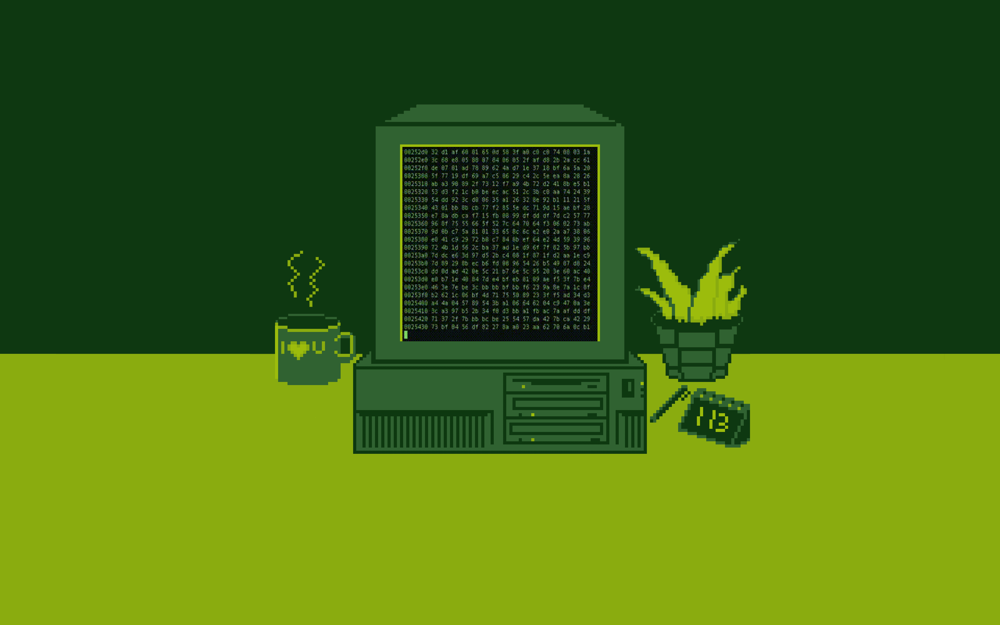
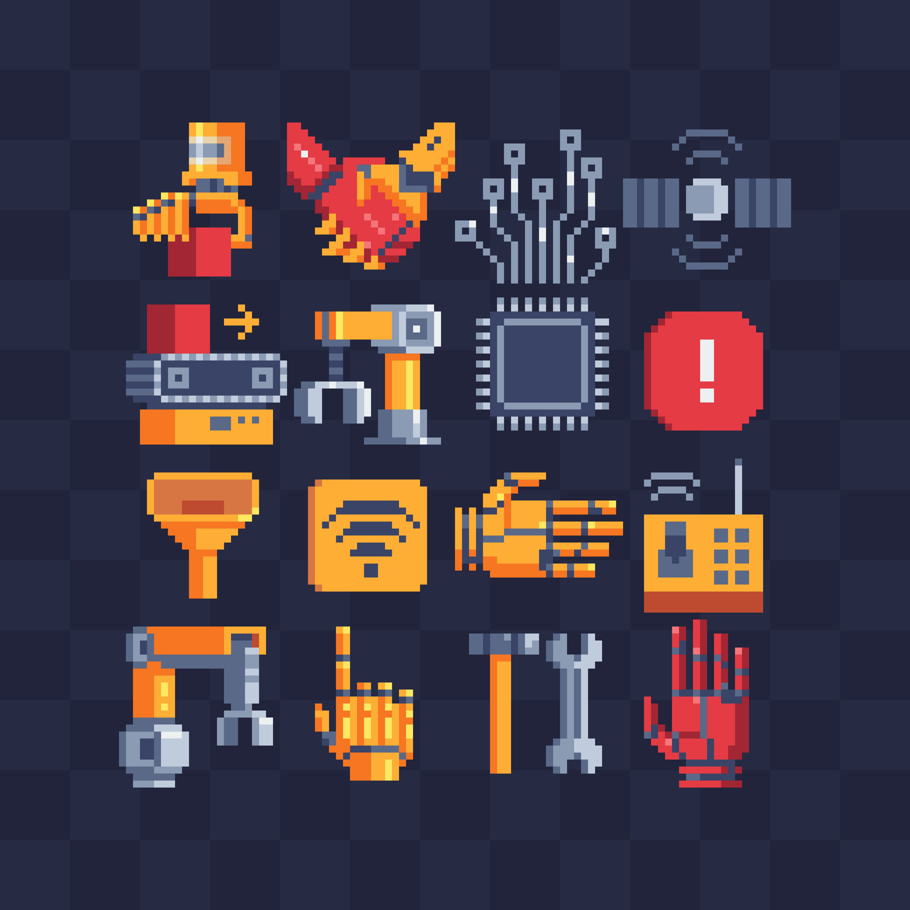
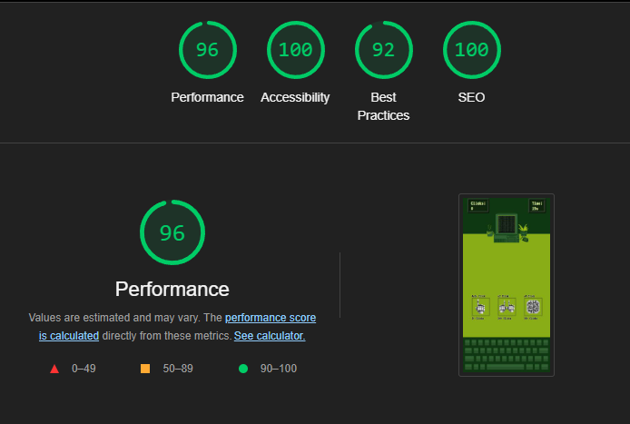

# Crunch Time!

"Crunch Time!" is a website hosting a clicker game in which your goal is to gain as much points as possible in given time using clicks and power-ups. 

View the live site: [Crunch Time!](https://bidran.github.io/Crunch-Time/)

## CONTENTS

* [User Experience](#user-experience-ux)
  * [User Stories](#user-stories)

* [Design](#design)
  * [Imagery](#imagery)
  * [Wireframes](#wireframes)

* [Features](#features)
  * [General Features on Each Page](#general-features-on-each-page)
  * [Accessibility](#accessibility)

* [Technologies Used](#technologies-used)
  * [Languages Used](#languages-used)

* [Deployment & Local Development](#deployment--local-development)
  * [Deployment](#deployment)
  * [Local Development](#local-development)
    * [How to Fork](#how-to-fork)
    * [How to Clone](#how-to-clone)

* [Testing](#testing)
  * [W3C Validator](#w3c-validator)
  * [Lighthouse](#lighthouse)
  * [Solved Bugs](#solved-bugs)
  * [Known Bugs](#known-bugs)
  * [Functional testing](#functional-testing)

* [Credits](#credits)
  * [Content](#content)
  * [Media](#media)
  * [Acknowledgments](#acknowledgments)

## User Experience (UX)

### Initial Discussion
"Crunch Time!" is a clicker game with power-ups.

#### Key information for the site

* What is "Crunch Time!".
* What are the controls.
* The main game.
* The final score.

### User Stories

#### Client Goals

* To be able to view the site on a range of device sizes.
* To make it easy for everyone to find out how to play.
* To have fun.

#### First Time Visitor Goals

* I want to find out what is "Crunch Time!".
* I want to be able to navigate the site easily to find information.
* I want to be able to know the controls.

#### Returning Visitor Goals

* I want to play the game again.
* I want to refresh my memory on rules.
* I want to be able to beat my high-score.

#### Frequent Visitor Goals

* I want to be able to try beating my high-score.

## Design

### Colour Scheme

I chose the colors which were used on a gif [Background image by Nela Gluhak](https://www.artstation.com/artwork/qQP2vL) which influnced most of my design.

### Typography

Font family VT323 was used with monospace functioning as a backup font. This font was chosen because it lines up with the rest of the design which gives off retro aesthetic.

### Imagery

The background image used was  which was then modified by me to remove elements on the side to better fit website framing.

The keyboard with simple design was chosen to avoid making the screen look cluttered,
The colors were changed to fit the colors of the background.

Robotic pixel art which I changed to white neutral color to avoid clashing with already strong colors that are present.

Images used were from stock images websites Shutterstock, ArtStation and Pixilart. They have been credited in the [credits](#Credits) section.

### Wireframes

Wireframes created for desktop and mobile showing the original idea behind the project.

#### Introduction

#### Game

#### Score

### Features

The website is comprised of three pages. Introduction page, game page & 404 page.

### General features on each page

#### Intro Page.
  * Intro Section.

    * An introduction on what "Crunch Time!" is.
    * Gives basic info about the game such as time, controls and power-ups.

        

 * Start button.
    
    * A button.
    * This allows the user to start the game, leading to another page.

        

#### Game page.

 * Header section.
    * Consists of "Clicks" and "Time". 
    * Allows the user to know how many clicks they have and how much time they have left.

        
      
      
 * Keyboard section.
    * Contains an image of a keyboard. 
    * Allows user to click the keyboard to gain points. 

        

  * Power-Ups section.

    * Contains an three buttons with different attributes.
    * This section gives the users the option to spend their earned points on upgrades (Auto-Click, x2 Clicks & x4 Clicks).

    

* End screen section.

    * Contains a final score, a highscore, retry button and a home button .
    * This section gives the users the option to view their final score, their biggest score, to reset the game to try again or to go back to the home page.

    

#### 404 page.
  * 404 section.

    * Contains text with a button to lead to the home page.
    * This section provides users with the opportunity to go back to the home page with a click of a button if their page returns 404 error.
      
      

### Accessibility
[Wave Accessibility](https://wave.webaim.org/) tool was used throughout development and for final testing of the deployed website to check for any aid accessibility testing.

Testing was focused to ensure the following criteria were met:

- Color contrasts meet a minimum ratio as specified in [WCAG 2.1 Contrast Guidelines](https://www.w3.org/WAI/WCAG21/Understanding/contrast-minimum.html)
- Heading levels are not missed or skipped to ensure the importance of content is relayed correctly to the end user
- All content is contained within landmarks to ensure ease of use for assistive technology, allowing the user to navigate by page regions
- All not textual content had alternative text or titles so descriptions are read out to screen readers
- HTML page lang attribute has been set
- Aria properties have been implemented correctly
- WCAG 2.1 Coding best practices being followed

Manual tests were also performed to ensure the website was accessible as possible and an accessibility issue was identified.

Issue #1: Wave showed contrast error for power-ups text.

Fix: Switched to black color text with a white text shadow for better accessibility.

## Technologies Used

* [Visual Studio Code](https://code.visualstudio.com) - To code the website.

* [Balsamiq](https://balsamiq.com/wireframes/) - Used to create wireframes.

* [Git](https://git-scm.com) - For version control.

* [Github](https://github.com) - To save and store the files for the website.

* [Google Dev Tools](https://developer.chrome.com/docs/devtools/) - To troubleshoot and test features, solve issues with responsiveness and styling.

* [Shutterstock](https://www.shutterstock.com/) - To acquire royalty free images.

* [Pexels](https://www.pexels.com/) - To acquire royalty free images.

* [Favicon.io](https://favicon.io/) - To create favicon.

* [Am I Responsive?](http://ami.responsivedesign.is/) - To show the website image on a range of devices.

* [Pixlr](https://pixlr.com/) - To edit the images to fit the theme of the website.

* [Adobe Photoshop](https://www.adobe.com/ie/products/photoshop.html) - To edit the gif and icons to fit website design.

### Languages Used

* The structure of the website was developed using HTML as the main language.

* The website was styled using CSS.

* The website functionality was developed using Javascript.

## Deployment & Local Development

### Deployment

The site was created using the Visual Studio code editor and pushed to github to the remote repository ‘Crunch-Time’.

Github Pages was used to deploy the live website. The instructions to achieve this are below:

1. Log in (or sign up) to Github.
2. Find the repository for this project, Crunch-Time.
3. Click on the Settings link.
4. Click on the Pages link in the left hand side navigation bar.
5. In the Source section, choose main from the drop down select branch menu. Select Root from the drop down select folder menu.
6. Click Save. Your live Github Pages site is now deployed at the URL shown.

### Local Development

#### How to Fork

To fork the Crunch-Time repository:

1. Log in (or sign up) to Github.
2. Go to the repository for this project, bidran/Crunch-Time.
3. Click the Fork button in the top right corner.

#### How to Clone

To clone the Crunch-Time repository:

1. Log in (or sign up) to GitHub.
2. Go to the repository for this project, bidran/Crunch-Time.
3. Click on the code button, select whether you would like to clone with HTTPS, SSH or GitHub CLI and copy the link shown.
4. Open the terminal in your code editor and change the current working directory to the location you want to use for the cloned directory.
5. Type 'git clone' into the terminal and then paste the link you copied in step 3. Press enter.

## Testing

### W3C Validator
* HTML
  * No errors were returned when passing through the official [W3C validator](https://validator.w3.org)

* CSS
    * No errors were found when passing through the official [(Jigsaw) validator](https://jigsaw.w3.org)
    

    

      

    
* Javascript
    * No errors were found when passing through the [Jshint validator](https://jshint.com)
    
      

### Lighthouse

Desktop lighthouse testing

 

 

* Lighthouse shows slower performance because of stylistic choice of using an animation which takes 1.5 seconds to finish.
 

 

 

Mobile lighthouse testing

 

  

 

 

### Solved Bugs

  1. On smaller devices, background colour would show between header and background image.
      
     
      
 
      This issue was solved by putting a -2px margin on top.
 
   2. Introduction icons were not centered
      
      
 
      This issue was solved by making each of the divs have fixed width.

   3. The highscore was immediately saved as an old score.
      
      
 
      This issue was solved by replacing highscore functioning to use local storage rather than basic variables.
    
   4. Validator was showing duplicate id names.
      
      
 
      This issue was solved removing the id names which were caused by copying the img elements.

### Known Bugs

No bugs were found by when testing the final version of the website.

### Functional Testing

Functional testing was made troughout the development on various browsers (Opera, Chrome & Firefox), devices (PC & Samsung A23 5G) as well as [Responsive Design Checker](https://responsivedesignchecker.com).

---------

## Credits

### Content

### Media
A variety of stock images from [Pexels](https://www.pexels.com/) & [Shutterstock](https://www.shutterstock.com/) were used for this project.

* Introduction
    * [Keyboard by Symuhn](https://www.pixilart.com/art/rfp-gaming-keyboard-588fd42e13fb9f2?)
    * [Button icons by VectorPixelStar ](https://www.shutterstock.com/image-vector/automation-icons-set-robotics-logo-mechanical-778219618)

* Game page
    * [Background image by Nela Gluhak](https://www.artstation.com/artwork/qQP2vL)
    * [Keyboard by Symuhn](https://www.pixilart.com/art/rfp-gaming-keyboard-588fd42e13fb9f2?)

    * [Button icons by VectorPixelStar ](https://www.shutterstock.com/image-vector/automation-icons-set-robotics-logo-mechanical-778219618)

    
   

### Acknowledgments

I would like to thank following people for helping me with my first project:
    
* [Gareth McGirr](https://github.com/Gareth-McGirr/) - My mentor, for helping me troughout this project with his advice
